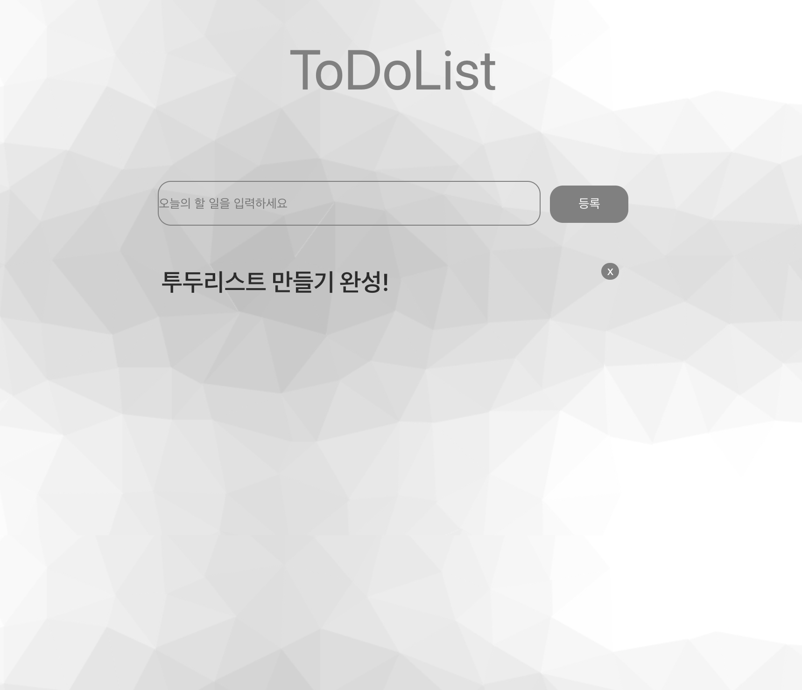

# ToDo-List

## 🔍 프로젝트 개요

<h3>타입스크립트+리액트를 활용한 투두리스트</h3>

 

## 📌 주요 기능

- 투두리스트 불러오기
- 투두리스트 작성
- 투두리스트 삭제

 

## 🛠 Front-End 기술스택

  
  
  
  
  
  
  

 

## 🛠 Back-End 기술스택

</a>

 
## ✍️ Client를 작업하며 배운 점 및 느낀 점
리액트 및 리덕스에 타입스크립트를 적용하는 것이 생각보다 어려웠습니다.
하지만 이번 프로젝트를 통해 열심히 어려움과 부딪히면 해결할 수 있다는 것을 배웠습니다
아직은 정말 부끄러운 코드지만 정말 공부를 열심히해서 타입스크립트를 적용하는 것을
능숙하게 하고 싶습니다!
## ✍️ Server를 작업하며 배운 점 및 느낀 점
이번 프로젝트는 서버를 제 혼자 힘으로 처음 만드는 프로젝트여서 쉬운 프로젝트임에도
버벅이는 부분이 많고 막히는 부분이 많았습니다.
구글링과 전에 강의를 통해 진행했던 프로젝트를 참고하며 하나씩 차근차근 막히는 부분을 헤쳐나갔고
Postman에서 각 요청들이 성공했을 때 쾌감은 잊을 수 없습니다!
이번 프로젝트는 정말 작은 프로젝트였지만 저에게 정말 좋은 성장의 밑거름이 되는 프로젝트였던 것 같습니다!
